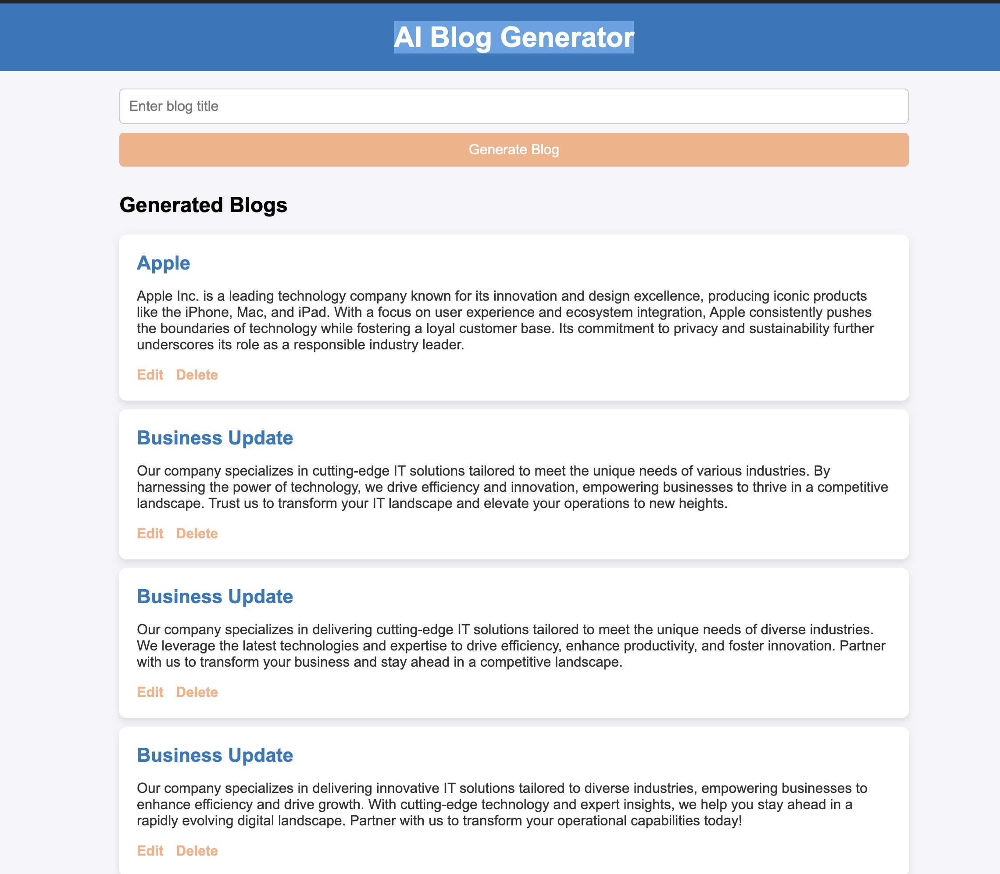

# AI Post Generator - Django

This is an AI-powered post generator built using Django and OpenAI API. It automates post creation using AI and schedules them with Celery.

## Features
- Generate posts using OpenAI API.
- Background task processing with Celery.
- Periodic task scheduling using Django Celery Beat.

## Prerequisites
Make sure you have the following installed:
- Python 3.8+
- Redis
- PostgreSQL/MySQL (Optional, but recommended for production)
- Django
- Celery
- Django Celery Beat

## Installation

### 1. Clone the repository
```sh
git clone https://github.com/yourusername/ai-post-generator.git
cd ai-post-generator
```

### 2. Create a virtual environment
```sh
python -m venv venv
source venv/bin/activate  # On Windows use: venv\Scripts\activate
```

### 3. Install dependencies
```sh
pip install -r requirements.txt
```

### 4. Configure environment variables
Create a `.env` file and add your OpenAI API key:
```env
OPENAI_API_KEY=your_openai_api_key
```

### 5. Apply migrations
```sh
python manage.py migrate
```

### 6. Create a superuser (Optional, for admin access)
```sh
python manage.py createsuperuser
```

## Running the Project

### 1. Start the Django server
```sh
python manage.py runserver
```

### 2. Start Redis server
```sh
redis-server
```

### 3. Start Celery worker
```sh
celery -A your_project_name worker --loglevel=info
```

### 4. Start Django Celery Beat
```sh
python manage.py celery beat
```

### 5. Run the Scheduler
```sh
python manage.py run_scheduler
```

## Example Screenshot
Below is an example screenshot of the AI-generated post feature:



## License
This project is licensed under the MIT License.

## Contributing
Feel free to fork the project and submit pull requests!

## Contact
For any issues, reach out via email at `arunk@infinitysofsystem.com`.

